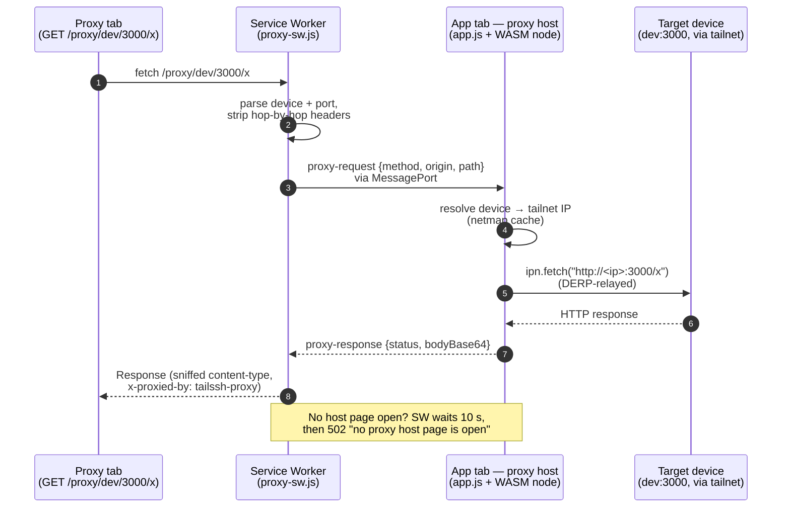

# TailSSH

A 100% browser-based SSH terminal to Tailscale machines using Tailscale's WASM, deployed with Cloudflare Workers.

> **Access controls recommended.**
> The app itself has no login wall and holds no Tailscale credentials: each
> visitor's browser WASM node joins **whatever tailnet the visitor logs in
> with** (as an ephemeral node), and they only see the devices their own
> identity permits. A stranger reaching the URL cannot touch your tailnet —
> but consider Cloudflare Access if you don't want the Worker acting as a
> public WASM host.

---

## Enable Tailscale SSH

TailSSH connects to machines using **Tailscale SSH** — certificate-based SSH
that requires no passwords and no key distribution. You must enable it on every
machine you want to reach.

Full documentation: <https://tailscale.com/docs/features/tailscale-ssh>

**Quick steps per target machine:**

```sh
# Linux / macOS — enable Tailscale SSH
sudo tailscale set --ssh

# Verify it is active
tailscale status
# Look for "offers SSH" next to the machine entry
```

On the Tailscale admin console you also need an ACL rule that grants your user
(or a tag) SSH access. The minimal addition to your `acls` block:

```json
{
  "action": "accept",
  "src":    ["autogroup:member"],
  "dst":    ["autogroup:self"],
  "users":  ["autogroup:nonroot", "root"]
}
```

Adjust `src`, `dst`, and `users` to match your security policy.

---

## Installation

```sh
git clone <your-repo-url>
cd tailssh
npm install
npm run build        # vendors pkg.js / main.wasm / pkg.css into public/
```

---

## Local development

1. Start the local dev server:

   ```sh
   npm run dev
   ```

   Wrangler serves the app at `http://localhost:8787`.

2. Open `http://localhost:8787` in your browser. The Tailscale WASM node will
   boot, open a Tailscale login tab, and authenticate as an ephemeral node
   under **your** Tailscale account. The device list is then populated from
   the netmap that node receives — no API token is needed anywhere.

---

## Port proxy (`/proxy/<device>/<port>/…`)

Besides SSH, the app can proxy **HTTP traffic to any TCP port on any tailnet
device** through generated URLs:

```
/proxy/<device>/<port>/<path>?<query>
```

Examples:

```
/proxy/aliyun-yl/3000/package.json     → http://<aliyun-yl's tailnet IP>:3000/package.json
/proxy/100.81.0.16/8080/admin          → http://100.81.0.16:8080/admin
/proxy/mbp/5900/                       → any HTTP service on mbp:5900
```

The device segment accepts a MagicDNS short name (`aliyun-yl`), a full FQDN
(`aliyun-yl.tailnet.ts.net.`), or a bare tailnet IP.

### How it works

Cloudflare Workers cannot open arbitrary outbound TCP connections, and the
browser WASM node cannot listen on ports — so neither side can serve the
proxy alone. The feature chains three pieces together:



1. **`public/proxy-sw.js`** — a Service Worker scoped to the whole app. It
   intercepts `fetch` for `/proxy/*` URLs, extracts `<device>` and `<port>`,
   strips hop-by-hop headers, and forwards the request to the app page over a
   `MessageChannel` port. If no host page is open it waits up to 10 s, then
   returns `502 "no proxy host page is open"`.
2. **`public/app.js` (proxy host)** — the main app tab registers itself as the
   host (`startProxyHost()` at module load). For each request it resolves the
   device name to a tailnet IP via the netmap cache (the WASM node has no DNS
   resolver), then calls `ipn.fetch("http://<ip>:<port><path>")`.
3. **The WASM node** dials the target through the tailnet (DERP-relayed for
   browser WASM — see the tailvnc notes for why direct UDP is impossible
   here) and returns `{status, statusText, text()}`.

Because `ipn.fetch()` in the current `@tailscale/connect` build is **GET-only
and returns no response headers**, the host layer:

- rejects non-GET/HEAD methods with an explicit error (no silent POST→GET
  downgrade),
- sniffs `content-type` from the body (HTML/JSON/plain) so proxied pages and
  APIs render correctly.

### Requirements & limitations

- **The main app tab must stay open** — it is the proxy engine. Closing it
  makes in-flight and new proxy requests fail with `502` after the host
  timeout. A proxy URL opened directly (e.g. from a bookmark) works only
  while another tab has the app open; the SW holds the request until a host
  registers or the 10 s timeout fires.
- **GET/HEAD only** — the pinned `@tailscale/connect` (1.39.98, and the
  latest 1.102.3 alike) exposes no raw-TCP `ipn.tcp()`; that method exists
  only in the tailscale repo's unmerged `origin/vnc` branch (which tailvnc's
  submodule uses). Upgrading the npm package does not add it.
- **Device must be in the netmap** — names are resolved from the ephemeral
  node's own netmap, so ACL visibility rules apply exactly as for SSH.
- **Auth is shared with the app** — the proxy reuses the logged-in WASM node;
  there is no separate credential surface.
- Response headers from the target are not preserved (single sniffed
  `content-type`); `content-encoding`/`transfer-encoding` are stripped so the
  browser can decode the plain body.

### Testing the proxy

1. Start the dev server and open the app:

   ```sh
   npm run dev
   # open http://localhost:8787 and complete Tailscale login
   ```

2. Start a test listener on any tailnet device (here: `mbp`, on its tailnet
   IP, so the WASM node can reach it):

   ```sh
   ssh mbp 'while true; do echo "HELLO-FROM-MBP-$(date +%s)" | nc -l 100.81.0.12 9999 >/dev/null; done'
   ```

3. In the app, click **Proxy…** on a device card and enter the port, or open
   the URL directly:

   ```
   http://localhost:8787/proxy/mbp/9999/
   ```

   Expected: the page renders `HELLO-FROM-MBP-<timestamp>` (one line per
   reload — the `nc` listener serves one connection then exits).

4. Test a real HTTP service (device running anything on :3000):

   ```
   http://localhost:8787/proxy/aliyun-yl/3000/package.json
   ```

   Expected: the target's `package.json` JSON, served with
   `application/json` and an `x-proxied-by: tailssh-proxy` header.

5. Error paths worth exercising:

   | URL | Expected |
   |---|---|
   | `/proxy/mbp/99999/` | `400` — `invalid port "99999"` |
   | `/proxy/bad_..name/80/` | `400` — `invalid device` |
   | `/proxy/mbp/9999/` (listener down) | `502` — dial/timeout error from `ipn.fetch` |
   | `/proxy/mbp/9999/` with app tab closed | `502` — `no proxy host page is open` (after 10 s) |

**Important:** the proxy only works in a browser — `curl` cannot exercise it
(Service Workers don't run outside browsers; curl just gets the SPA fallback
`index.html`). When testing locally, also bypass any system HTTP proxy for
localhost (`curl --noproxy '*'` / `NO_PROXY=127.0.0.1,localhost`), otherwise
a local proxy like `127.0.0.1:7890` intercepts the request.

**Service Worker caching gotcha:** after changing `proxy-sw.js` or the proxy
code in `app.js`, a normal reload may keep serving the **old** worker (SW
updates are asynchronous and only take over after all tabs close, unless
`skipWaiting` fires). If you see stale behavior such as
`{"error":"bad path /…"}`, unregister first: DevTools → Application →
Service Workers → **Unregister** (or Application → Storage → Clear site
data), then hard-reload (Cmd+Shift+R).

---

## Deployment

### 1. First deploy

If this is your first deploy, Wrangler will create the project automatically.
There is no server-side code — the deployment is pure static assets served by
Cloudflare's Workers infrastructure. The name is set in `wrangler.jsonc`
(`"name": "tailssh"`). Change it there if you want a different subdomain.

### 2. Deploy

```sh
npm run deploy
```

Wrangler will print the deployed URL, which will be:

```
https://tailssh.<your-cf-subdomain>.workers.dev
```

### 3. Custom domain (optional)

To use your own domain instead of the `*.workers.dev` URL:

1. In the Cloudflare dashboard, open **Workers & Pages → tailssh → Settings →
   Domains & Routes**.
2. Add a route or custom domain pointing to the Worker.
3. Ensure the domain is proxied through Cloudflare (orange-cloud in DNS).

**Reminder:** a custom domain makes the app easier to find. If your domain is
publicly resolvable, add an access control layer (Cloudflare Access is free for
up to 50 users) before sharing the URL with anyone.

---

## Security notes

- There is **no server-side code, no secrets and no Tailscale credentials** —
  the deployment is pure static assets.
- Each browser session creates an **ephemeral** Tailscale node under the
  identity the visitor logs in with; the node disappears from that tailnet
  automatically when the tab is closed.
- The device list comes from the ephemeral node's own netmap, so it only ever
  contains peers the logged-in user's tailnet ACLs let them see. Users see
  their own tailnet — never the deployer's.
- SSH credentials are certificate-based via Tailscale SSH — no passwords are
  stored or transmitted by this app.
- Tailscale ACLs govern which users can SSH into which machines. TailSSH does
  not bypass them.

---

## Content Security Policy (planned)

The site is pure static assets, so a policy can only ship as a `<meta>` tag
in `index.html` (or a `_headers` file — see rollout below). Nothing is
enforced yet; this is the target policy and the open questions to settle
before turning it on.

### Draft policy

```html
<meta http-equiv="Content-Security-Policy" content="
  default-src 'self';
  script-src 'self' 'wasm-unsafe-eval';
  style-src 'self';
  img-src 'self' data:;
  font-src 'self';
  connect-src 'self' https://*.tailscale.com wss://*.tailscale.com https://log.tailscale.io;
  base-uri 'self';
  form-action 'self';
  object-src 'none'">
```

Why each part:

| Directive | Rationale |
|---|---|
| `script-src 'self' 'wasm-unsafe-eval'` | `app.js` / `pkg.js` / the vendored Alpine (`public/alpine.esm.js`, pinned to 3.16.3 — no third-party script origin at all) are same-origin. The Go runtime needs `'wasm-unsafe-eval'` to compile `main.wasm`. |
| `connect-src 'self' https://*.tailscale.com wss://*.tailscale.com https://log.tailscale.io` | Verified against a captured session HAR (2026-08). The browser node talks to `controlplane.tailscale.com` (netmap + a persistent `wss://` watch connection), the DERP relays (https polling + `wss://` relays, hosts like `derp18d.tailscale.com` — still `*.tailscale.com`), and `log.tailscale.io` (runtime logs — note the **tailscale.io** domain, not tailscale.com). Tailnet traffic (SSH, peerapi latency probes) is *tunneled inside* the DERP connections — the HAR shows **zero** browser-level requests to `100.x` addresses, so no per-device exceptions are needed. The explicit `wss://` entries guard against browsers not honoring the CSP `https → wss` scheme upgrade. |
| `style-src 'self'` | Requires migrating the `<noscript>` fallback out of its inline `<style>` first (e.g. an `html.no-js` class toggle); otherwise `'unsafe-inline'` would be needed. |
| `object-src 'none'`, `base-uri 'self'`, `form-action 'self'` | Cheap hardening — the page has no plugins, forms, or scriptable bases. |

### Open questions before enforcing

1. Do the explicit `wss://` entries hold everywhere, or can `https://`
   sources be relied on to cover `wss://` (CSP3 scheme upgrade)? The HAR
   confirms `wss://controlplane.tailscale.com` and `wss://derp*.tailscale.com`
   are both in use. Verify on Chrome / Firefox / Safari.
2. Custom DERP servers, if the tailnet ever configures any, must be added
   to `connect-src`.
3. ~~Confirm no other browser-level origins are contacted~~ — resolved by the
   session HAR: the complete origin inventory is `self` (workers.dev),
   `*.tailscale.com` (control / DERP) and `log.tailscale.io` (logs). Alpine
   has since been vendored (`public/alpine.esm.js`), removing the unpkg
   origin the HAR still shows. Re-verify after any dependency change.

### Recommended rollout

Meta tags cannot carry `frame-ancestors` / `X-Frame-Options`
(clickjacking protection needs real headers). Workers static assets
support a `_headers` file in the assets directory, which is the better
home for the final policy:

```
# public/_headers
/*
  Content-Security-Policy: <same policy, plus frame-ancestors 'none'>
  X-Content-Type-Options: nosniff
  Referrer-Policy: no-referrer
  Permissions-Policy: camera=(), microphone=(), geolocation=()
```

Suggested sequence: add `public/_headers` with
`Content-Security-Policy-Report-Only`, browse the whole app, fix any
reported violations, then switch the header to enforcing
`Content-Security-Policy`.

---

## Project structure

```
tailssh/
├── build.js            # Asset vendor script — see below
├── package.json
├── wrangler.jsonc      # Cloudflare config (assets-only, no server code)
└── public/
    ├── index.html
    ├── style.css
    ├── app.js          # Browser entry point (SSH sessions + proxy host)
    ├── proxy-sw.js     # Service Worker: /proxy/<device>/<port>/ interception
    ├── alpine.esm.js   # Vendored Alpine 3.16.3 (no third-party script origin)
    ├── pkg.js          # @tailscale/connect ESM bundle (build output)
    ├── wasm-url.js     # One-liner exposing the hashed wasm path (build output)
    ├── _headers        # Custom response headers (immutable wasm caching; CSP later)
    ├── assets/
    │   └── main.<hash>.wasm  # Tailscale WASM binary (build output, immutable cache)
    └── pkg.css         # xterm.js base styles (build output)
```

### build.js

There is no Webpack/Vite/esbuild in this project. `build.js` is a plain Node
ESM script that copies three files out of `node_modules/@tailscale/connect` into
`public/`:

| File | What it is |
|---|---|
| `pkg.js` | Self-contained ESM bundle — includes xterm.js, FitAddon, WebLinksAddon, the `wasm_exec` shim, and the `createIPN` / `runSSHSession` exports. |
| `assets/main.<hash>.wasm` | The Go WASM binary (~22 MB), copied under a content-hash name and served with `Cache-Control: immutable` (see `public/_headers`), so repeat visits never re-download it. Kept as a separate file so the browser can use `WebAssembly.instantiateStreaming()` — inlining it into JS would break streaming compilation and exceed size limits. `app.js` learns the path from `wasm-url.js` via `createIPN({ wasmURL })`. |
| `pkg.css` | xterm.js base stylesheet shipped by `@tailscale/connect`. |

`pkg.js` is already a self-contained bundle; re-bundling it through a tool like
esbuild would break its internal relative path resolution for `main.wasm`. The
build step is intentionally just a file copy.

`npm run build` (and therefore `npm run dev` / `npm run deploy`) runs `build.js`
automatically. You only need to re-run it manually if you update the
`@tailscale/connect` package.

---

## Updating Tailscale

The Tailscale WASM bundle is pinned to a specific `@tailscale/connect` version
in `package.json`. To update:

```sh
npm install @tailscale/connect@latest
npm run build
```

Test locally before deploying — the `createIPN` / `runSSHSession` API surface
can change between releases.
